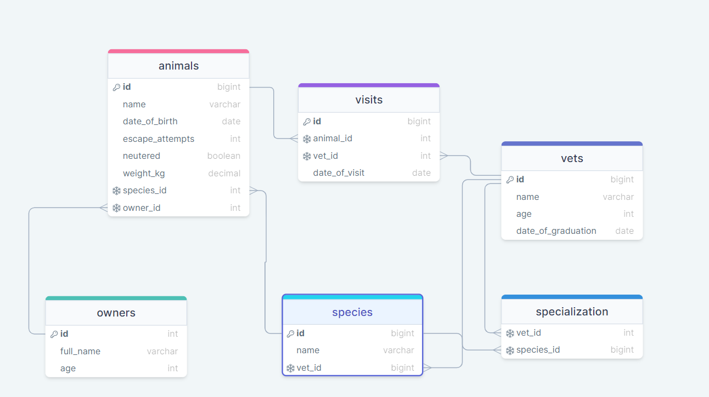

<a name="readme-top"><h1 align="center">VET CLINIC DATABASE</h1></a>

<!-- TABLE OF CONTENTS -->

# 📗 Table of Contents

- [📖 About the Project](#about-project)
  - [🛠 Built With](#built-with)
    - [Tech Stack](#tech-stack)
    - [Key Features](#key-features)
  - [🚀 Live Demo](#live-demo)
- [💻 Getting Started](#getting-started)
  - [Setup](#setup)
  - [Prerequisites](#prerequisites)
- [👥 Authors](#authors)
- [🔭 Future Features](#future-features)
- [🤝 Contributing](#contributing)
- [⭐️ Show your support](#support)
- [🙏 Acknowledgements](#acknowledgements)
- [❓ FAQ](#faq)
- [📝 License](#license)

<!-- PROJECT DESCRIPTION -->

# 📖 Vet Clinic Database <a name="about-project"></a>

Vet Clinic Database is relational database creates initial data structure for a vet clinic. It also has a table that store animals' information, insert some data into it, and query it.

## 🛠 Built With <a name="built-with"></a>

### Tech Stack <a name="tech-stack"></a>

<details>
<summary>Database</summary>
  <ul>
    <li><a href="https://www.postgresql.org/">PostgreSQL</a></li>
  </ul>
</details>

<!-- Features -->

### Key Features <a name="key-features"></a>

- Created a database based on a diagram.

<p align="right">(<a href="#readme-top">back to top</a>)</p>


### Schema Diagram <a name="key-features"></a>

- This is a screenshot of the schema diagram showing the relationship betweeen the tables


<p align="right">(<a href="#readme-top">back to top</a>)</p>

<!-- LIVE DEMO -->

## 🚀 Live Demo <a name="live-demo"></a>

`N/A`

<p align="right">(<a href="#readme-top">back to top</a>)</p>

<!-- GETTING STARTED -->

## 💻 Getting Started <a name="getting-started"></a>

To get a local copy up and running, follow these steps.

### Prerequisites

In order to run this project you need:

```sh
 install PostgreSQL
```

### Setup

Clone this repository to your desired folder:

```sh
  git clone git@github.com:SabiMantock/vet-clinic-db.git
  cd vet-clinic-db
```

<p align="right">(<a href="#readme-top">back to top</a>)</p>

<!-- AUTHORS -->

## 👥 Authors <a name="authors"></a>

👤 **Theophilus Doku**

- GitHub: [@githubhandle](https://github.com/theodoku)
- Twitter: [@twitterhandle](https://twitter.com/dok_theo)
- LinkedIn: [LinkedIn](https://www.linkedin.com/in/theophilus-doku/)

👤 **Lornakaboro**

- GitHub: [@githubhandle](https://github.com/Lornakaboro)
- Twitter: [@twitterhandle](https://twitter.com/KaboroLorna)
- Linkedin [@linkedinprofile](https://www.linkedin.com/in/lorna-kaboro-23620b242/)

<p align="right">(<a href="#readme-top">back to top</a>)</p>

<!-- FUTURE FEATURES -->

## 🔭 Future Features <a name="future-features"></a>

Add more queries or More complex tables relationships etc

<p align="right">(<a href="#readme-top">back to top</a>)</p>

<!-- CONTRIBUTING -->

## 🤝 Contributing <a name="contributing"></a>

Contributions, issues, and feature requests are welcome!

Feel free to check the [issues page](https://github.com/theodoku/vet-clinic-db/issues).

<p align="right">(<a href="#readme-top">back to top</a>)</p>

<!-- SUPPORT -->

## ⭐️ Show your support <a name="support"></a>

Give a ⭐️, if you like this project!

<p align="right">(<a href="#readme-top">back to top</a>)</p>

<!-- ACKNOWLEDGEMENTS -->

## 🙏 Acknowledgments <a name="acknowledgements"></a>

I would like to thank [Microverse](https://github.com/microverseinc) for this project

<p align="right">(<a href="#readme-top">back to top</a>)</p>

<!-- LICENSE -->

## 📝 License <a name="license"></a>

This project is [MIT](./LICENSE) licensed.

<p align="right">(<a href="#readme-top">back to top</a>)</p>
